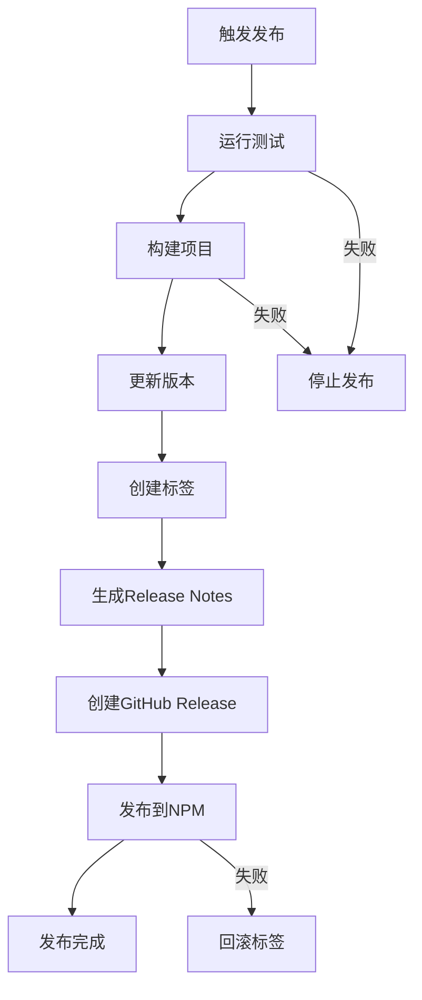

# 📦 Claude TDD CLI 发布指南

本文档描述了 Claude TDD CLI 项目的完整发布流程，包括版本管理、自动化发布和最佳实践。

## 🚀 快速发布

### 方式一：GitHub Actions 手动触发（推荐）

1. **访问 GitHub Actions**
   ```
   https://github.com/MuziGeek/claude-tdd-cli/actions/workflows/release.yml
   ```

2. **点击 "Run workflow"**
   - 选择分支：`main`
   - 选择版本类型：
     - `patch` - 修复版本 (0.2.4 → 0.2.5)
     - `minor` - 功能版本 (0.2.4 → 0.3.0)
     - `major` - 重大版本 (0.2.4 → 1.0.0)
     - `prerelease` - 预发布版本 (0.2.4 → 0.2.5-beta.0)

3. **自动化流程执行**
   - ✅ 运行测试套件
   - ✅ 构建项目
   - ✅ 更新版本号
   - ✅ 创建 Git 标签
   - ✅ 生成 Release Notes
   - ✅ 创建 GitHub Release
   - ✅ 发布到 NPM

### 方式二：GitHub Release 页面发布

1. **创建 GitHub Release**
   - 访问：https://github.com/MuziGeek/claude-tdd-cli/releases/new
   - 创建新标签：`v0.x.x`
   - 填写发布说明
   - 点击 "Publish release"

2. **自动触发 NPM 发布**
   - Release 创建后自动触发 NPM 发布流程

## 🔧 发布前准备

### 1. 环境检查

```bash
# 确保在正确的分支
git checkout main
git pull origin main

# 检查工作目录干净
git status

# 运行完整测试
npm test

# 检查构建
npm run build
```

### 2. 版本决策

根据变更内容选择合适的版本类型：

| 变更类型 | 版本类型 | 示例 | 说明 |
|---------|---------|------|------|
| 🐛 Bug修复 | `patch` | 0.2.4 → 0.2.5 | 向后兼容的修复 |
| ✨ 新功能 | `minor` | 0.2.4 → 0.3.0 | 向后兼容的功能 |
| 💥 Breaking Changes | `major` | 0.2.4 → 1.0.0 | 不兼容的变更 |
| 🧪 预发布 | `prerelease` | 0.2.4 → 0.2.5-beta.0 | 测试版本 |

### 3. 更新文档

发布前确保以下文档是最新的：

- [ ] `README.md` - 项目介绍和使用说明
- [ ] `CHANGELOG.md` - 在 [未发布] 区域添加新变更
- [ ] `USAGE.md` - 使用指南更新
- [ ] `examples/` - 示例项目更新

## 📋 发布检查清单

### 发布前检查
- [ ] 所有 CI 测试通过
- [ ] 代码已合并到 `main` 分支
- [ ] 工作目录干净（无未提交更改）
- [ ] CHANGELOG.md 已更新
- [ ] 版本号决策已确定
- [ ] NPM_TOKEN 密钥已配置

### 发布过程检查
- [ ] GitHub Actions 工作流成功执行
- [ ] 新版本标签已创建
- [ ] GitHub Release 已创建
- [ ] NPM 包已发布
- [ ] Release Notes 已生成

### 发布后验证
- [ ] NPM 包可正常安装：`npm install -g claude-tdd-cli@latest`
- [ ] CLI 命令正常工作：`claude-tdd --version`
- [ ] GitHub Release 页面显示正常
- [ ] 文档链接正确且可访问

## 🔑 密钥配置

### NPM_TOKEN 设置

1. **获取 NPM Token**
   ```bash
   npm login
   npm token create --read-only  # 或 --publish 用于发布
   ```

2. **在 GitHub 中添加 Secret**
   - 访问：Settings → Secrets and variables → Actions
   - 添加新 Secret：`NPM_TOKEN`
   - 粘贴从 NPM 获取的 token

3. **验证配置**
   ```bash
   # 测试 token 是否有效
   curl -H "Authorization: Bearer YOUR_TOKEN" https://registry.npmjs.org/-/whoami
   ```

### GitHub Token 权限

确保 `GITHUB_TOKEN` 具有以下权限：
- `contents: write` - 创建标签和提交
- `packages: write` - 发布包（如果使用 GPR）
- `actions: read` - 读取 Actions 状态

## 📊 版本管理策略

### 分支策略

```
main (生产)     ←── 发布分支，保持稳定
  ↑
develop (开发)  ←── 开发分支，合并新功能
  ↑
feature/*       ←── 功能分支
hotfix/*        ←── 紧急修复分支
```

### 发布节奏

- **主版本** (Major): 重大架构变更，每年1-2次
- **次版本** (Minor): 新功能发布，每月1-2次  
- **修订版本** (Patch): 紧急修复，按需发布
- **预发布版本**: 测试新功能，持续发布

### 版本命名规范

```
v{MAJOR}.{MINOR}.{PATCH}[-{PRERELEASE}]

示例：
v1.0.0          # 正式版本
v1.0.1-beta.1   # 预发布版本
v1.0.1-alpha.2  # Alpha 版本
v1.0.1-rc.1     # Release Candidate
```

## 🔄 发布流程详解

### 自动化发布流程



### Release Notes 自动生成

工作流会自动从 Git 提交历史生成 Release Notes：

```bash
# 功能变更 (feat/feature)
- feat: 添加新的初始化模板
- feature: 支持 Rust 框架

# 修复 (fix/bugfix)  
- fix: 修复 Windows 路径问题
- bugfix: 解决测试覆盖率计算错误

# 文档 (docs/documentation)
- docs: 更新 API 文档
- documentation: 添加使用示例

# 其他改进 (chore/refactor/style)
- chore: 升级依赖版本
- refactor: 重构核心模块
- style: 代码格式化
```

## 🚨 故障处理

### 发布失败处理

1. **测试失败**
   ```bash
   # 修复测试后重新触发
   npm test
   git add .
   git commit -m "fix: 修复测试问题"
   git push
   ```

2. **构建失败**
   ```bash
   # 检查构建错误
   npm run build
   # 修复问题后重新发布
   ```

3. **NPM 发布失败**
   ```bash
   # 检查 NPM token 是否有效
   npm whoami
   
   # 手动发布
   npm publish --access public
   ```

### 回滚发布

如果发布后发现严重问题：

1. **NPM 包回滚**
   ```bash
   # 撤销发布（仅限发布后24小时内）
   npm unpublish claude-tdd-cli@0.x.x
   
   # 或者发布修复版本
   npm version patch
   npm publish
   ```

2. **GitHub Release 回滚**
   - 删除问题版本的 GitHub Release
   - 删除对应的 Git 标签
   ```bash
   git tag -d v0.x.x
   git push origin --delete v0.x.x
   ```

3. **通信用户**
   - 在 GitHub Issues 中发布公告
   - 更新 README 中的已知问题

## 📈 发布后任务

### 1. 验证发布

```bash
# 全局安装最新版本
npm install -g claude-tdd-cli@latest

# 验证版本
claude-tdd --version

# 测试核心功能
claude-tdd doctor
claude-tdd init --help
```

### 2. 更新文档

- 更新项目网站（如有）
- 发布博客文章或更新日志
- 更新社交媒体

### 3. 监控和反馈

- 监控 NPM 下载量
- 关注 GitHub Issues 中的问题报告
- 收集用户反馈

### 4. 准备下个版本

- 将 CHANGELOG.md 中的 [未发布] 内容移动到新版本
- 创建下个版本的 milestone
- 规划新功能和改进

## 📞 联系和支持

- **项目主页**: https://github.com/MuziGeek/claude-tdd-cli
- **问题报告**: https://github.com/MuziGeek/claude-tdd-cli/issues
- **功能请求**: https://github.com/MuziGeek/claude-tdd-cli/discussions
- **邮箱**: mz@easymuzi.cn

---

**最后更新**: 2025-09-08  
**文档版本**: 1.0.0