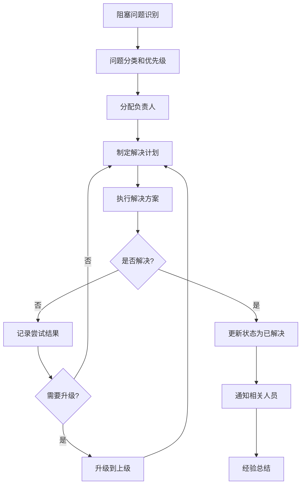

## 🚫 阻塞任务管理

专门管理项目中的阻塞任务，提供识别、跟踪、升级和解决的完整流程。

### 执行方式

```bash
# 查看当前所有阻塞任务
/pm:blocked

# 查看特定类型的阻塞
/pm:blocked --type "external-dependency"

# 添加新的阻塞问题
/pm:blocked add --task "T001" --type "technical" --description "Redis集成方案未确定"

# 更新阻塞状态  
/pm:blocked update --block-id "B001" --status "in-progress" --note "已联系架构师"

# 解决阻塞问题
/pm:blocked resolve --block-id "B001" --solution "采用Redis Cluster方案"

# 升级阻塞问题
/pm:blocked escalate --block-id "B001" --to "tech-lead"
```

### 阻塞分类和定义

#### 阻塞类型分类
```yaml
阻塞类型:
  external-dependency:
    description: "外部系统或服务依赖"
    examples:
      - "第三方API接口未就绪"
      - "外部数据源不可用"
      - "合作伙伴系统维护"
    escalationPath: "business-owner"
    
  technical-blocker:
    description: "技术难题或架构决策"
    examples:
      - "技术方案选型未确定"
      - "性能瓶颈无法解决"
      - "架构设计存在冲突"
    escalationPath: "tech-lead"
    
  resource-constraint:
    description: "人力或环境资源限制"
    examples:
      - "关键人员休假"
      - "测试环境不可用"
      - "硬件资源不足"
    escalationPath: "project-manager"
    
  business-decision:
    description: "业务决策或需求不明确"
    examples:
      - "产品需求待确认"
      - "业务流程待澄清"
      - "优先级调整待决策"
    escalationPath: "product-owner"
    
  quality-gate:
    description: "质量要求或合规性阻塞"
    examples:
      - "安全审查未通过"
      - "性能测试未达标"
      - "代码质量不符合标准"
    escalationPath: "quality-lead"
```

### 阻塞记录数据结构

#### 阻塞记录文件
**文件路径**: `docs/blocked/{BLOCK_ID}.blocked.md`

```yaml
blockInfo:
  id: "B001"
  title: "支付网关测试环境不可用"
  type: "external-dependency"
  severity: "high|medium|low"
  status: "active|in-progress|resolved|cancelled"
  createdAt: "2024-01-15T09:30:00Z"
  updatedAt: "2024-01-15T14:20:00Z"
  
affectedTasks:
  - taskId: "T019"
    taskTitle: "支付API集成测试"
    impact: "完全阻塞"
    estimation: "延迟3天"
    
  - taskId: "T020"  
    taskTitle: "支付异常处理"
    impact: "部分阻塞"
    estimation: "延迟1天"

blockDetails:
  description: |
    支付网关供应商系统维护，测试环境无法访问，
    影响所有支付相关功能的集成测试和开发验证。
    
  rootCause: "第三方供应商计划内系统升级"
  
  businessImpact:
    - "支付功能发布延迟"
    - "客户试用流程受影响"
    - "月度发布计划调整"
    
  technicalImpact:
    - "无法进行端到端测试"
    - "开发环境联调受阻"
    - "自动化测试失效"

resolution:
  owner: "bob.wilson"
  assignedAt: "2024-01-15T10:00:00Z"
  targetDate: "2024-01-17T23:59:59Z"
  
  attempts:
    - date: "2024-01-15T10:30:00Z"
      action: "联系供应商技术支持"
      result: "确认维护窗口为1-17日"
      status: "unsuccessful"
      
    - date: "2024-01-15T14:00:00Z"
      action: "申请临时测试账号"
      result: "供应商同意提供沙箱环境"
      status: "successful"

escalation:
  level: 1
  escalatedTo: "tech-lead"
  escalatedAt: "2024-01-15T11:00:00Z"
  reason: "影响关键功能发布时间"
  
notifications:
  alertedStakeholders:
    - "product-owner"
    - "project-manager"
    - "affected-developers"
  lastAlert: "2024-01-15T09:30:00Z"
  frequency: "daily"

workarounds:
  - description: "使用Mock服务进行本地开发"
    feasibility: "high"
    implementedBy: "alice.chen"
    effectiveness: "80%"
    
  - description: "延迟支付功能，优先其他模块"
    feasibility: "medium"
    implementedBy: "project-manager"
    effectiveness: "60%"
```

### 阻塞问题仪表板

#### 当前阻塞概览
```bash
/pm:blocked --dashboard
```

**输出示例**:
```
==================================================
🚫 阻塞任务仪表板
==================================================
更新时间: 2024-01-15 14:30:00 UTC

📊 阻塞概览:
  • 活跃阻塞: 5个 (高危: 2个, 中危: 2个, 低危: 1个)
  • 影响任务: 12个
  • 影响人员: 6人
  • 预计延迟: 总计8天

🔥 高危阻塞 (需要立即关注):

┌─ B001 - 支付网关测试环境不可用 ────────────────
│ 📅 创建: 1天前  │ 🎯 预期解决: 明日
│ 👤 负责人: bob.wilson  │ 📈 状态: 进行中
│ 🎯 影响: 3个任务, 2名开发者
│ 💡 当前行动: 使用沙箱环境临时替代
│ ⏱️  SLA: 剩余8小时 (🟡 临近超期)
└────────────────────────────────────────────────

┌─ B003 - 数据迁移脚本性能问题 ────────────────
│ 📅 创建: 3天前  │ 🎯 预期解决: 今日
│ 👤 负责人: data.engineer  │ 📈 状态: 升级中
│ 🎯 影响: 1个关键任务
│ 💡 当前行动: 架构师review优化方案
│ ⏱️  SLA: 超期1天 (🔴 需要紧急处理)
└────────────────────────────────────────────────

🟡 中等风险阻塞 (2个):
  • B002: 第三方OAuth服务配置 (alice.chen, 预计2天)
  • B004: 测试环境Redis内存不足 (devops.team, 预计1天)

🟢 低风险阻塞 (1个):  
  • B005: 文档模板格式调整 (tech.writer, 预计0.5天)

⚠️  风险提醒:
  • 2个阻塞将在24小时内超期
  • 支付系统发布可能延迟1周
  • 团队整体效率下降15%

📈 趋势分析 (最近7天):
  • 新增阻塞: 8个
  • 解决阻塞: 6个  
  • 平均解决时间: 2.3天
  • 升级率: 25% (2/8个被升级)
```

### 阻塞管理流程

#### 1. 阻塞识别和记录
```bash
# 快速添加阻塞
/pm:blocked add \
  --task "T019" \
  --type "external-dependency" \
  --severity "high" \
  --description "支付网关API返回502错误" \
  --owner "bob.wilson"

# 从任务状态自动识别阻塞
/pm:blocked scan --auto-detect

# 批量导入阻塞问题
/pm:blocked import --file "blocked-issues.csv"
```

#### 2. 阻塞分析和分类
```bash
# 根据描述自动分类
analyze_block_type() {
    local description="$1"
    
    case "$description" in
        *"第三方"*|*"外部"*|*"API"*) echo "external-dependency" ;;
        *"性能"*|*"架构"*|*"技术"*) echo "technical-blocker" ;;
        *"人员"*|*"环境"*|*"资源"*) echo "resource-constraint" ;;
        *"需求"*|*"业务"*|*"决策"*) echo "business-decision" ;;
        *) echo "unknown" ;;
    esac
}
```

#### 3. 解决方案跟踪
```bash
# 添加解决尝试记录
/pm:blocked log --block-id "B001" \
  --action "联系供应商技术支持" \
  --result "确认维护时间窗口" \
  --status "unsuccessful"

# 添加临时解决方案
/pm:blocked workaround --block-id "B001" \
  --solution "使用Mock服务替代" \
  --effectiveness "80%" \
  --implementer "alice.chen"
```

### 自动化监控和预警

#### SLA监控
```bash
# 检查超期阻塞
check_overdue_blocks() {
    local current_time=$(date +%s)
    
    find docs/blocked -name "*.blocked.md" -exec grep -l "status.*active" {} \; | \
    while read blocked_file; do
        local target_date=$(yq eval '.resolution.targetDate' "$blocked_file")
        local target_timestamp=$(date -d "$target_date" +%s)
        
        if [[ $current_time -gt $target_timestamp ]]; then
            local block_id=$(basename "$blocked_file" .blocked.md)
            echo "⚠️  阻塞 $block_id 已超期"
            
            # 自动升级超期阻塞
            /pm:blocked escalate --block-id "$block_id" --reason "SLA超期"
        fi
    done
}
```

#### 影响分析
```bash
# 分析阻塞对里程碑的影响
analyze_milestone_impact() {
    local milestone="$1"
    
    # 获取里程碑相关任务
    gh issue list --milestone "$milestone" --json number,title,labels
    
    # 检查这些任务是否被阻塞
    # 计算总延迟时间
    # 生成风险评估报告
}
```

### 阻塞解决工作流

#### 标准解决流程


#### 升级矩阵
```yaml
escalationMatrix:
  severity_high:
    level_0: "任务负责人" (0-4小时)
    level_1: "技术负责人" (4-8小时)  
    level_2: "项目经理" (8-24小时)
    level_3: "部门主管" (24-48小时)
    
  severity_medium:
    level_0: "任务负责人" (0-8小时)
    level_1: "技术负责人" (8-24小时)
    level_2: "项目经理" (24-72小时)
    
  severity_low:
    level_0: "任务负责人" (0-24小时)
    level_1: "技术负责人" (24-72小时)
```

### 报告和分析

#### 阻塞趋势报告
```bash
# 生成阻塞趋势分析
/pm:blocked report --period "monthly" --type "trend-analysis"

# 生成阻塞根因分析
/pm:blocked report --type "root-cause" --group-by "type"

# 生成团队阻塞处理效率报告
/pm:blocked report --type "efficiency" --team "backend-team"
```

#### 预防性分析
```bash
# 识别阻塞模式
identify_blocking_patterns() {
    # 分析历史阻塞数据
    # 识别重复出现的阻塞类型
    # 提供预防建议
    
    echo "🔍 阻塞模式分析:"
    echo "• 外部依赖阻塞占60% - 建议加强供应商SLA管理"
    echo "• 技术决策阻塞占25% - 建议提前进行架构评审"
    echo "• 资源约束阻塞占15% - 建议优化资源分配策略"
}
```

### 集成和通知

#### Slack通知
```json
{
  "blocked": {
    "slack": {
      "newBlock": {
        "channel": "#blocked-alerts",
        "template": "🚫 新阻塞: {{title}} ({{severity}}) - 负责人: @{{owner}}"
      },
      "escalation": {
        "channel": "#management",  
        "template": "⬆️ 阻塞升级: {{title}} - 已升级到 @{{escalated_to}}"
      },
      "resolved": {
        "channel": "#general",
        "template": "✅ 阻塞解决: {{title}} - 耗时{{duration}}"
      }
    }
  }
}
```

#### JIRA/GitHub集成
```bash
# 同步阻塞到GitHub Issues
/pm:blocked sync-github --create-labels

# 创建阻塞相关的GitHub Issue
/pm:blocked create-issue --block-id "B001" --assignee "bob.wilson"
```

### 最佳实践

#### 阻塞预防
1. **依赖前置识别**: 项目开始时识别所有外部依赖
2. **技术风险评估**: 早期识别技术难点并制定备选方案
3. **资源预留**: 为关键任务预留缓冲资源
4. **供应商管理**: 建立供应商SLA和备用方案

#### 快速响应
1. **实时监控**: 自动检测阻塞问题
2. **快速分类**: 标准化阻塞分类流程
3. **责任分配**: 明确的阻塞负责人机制
4. **升级路径**: 清晰的问题升级矩阵

#### 持续改进
1. **经验总结**: 每次阻塞解决后的回顾
2. **模式识别**: 分析重复阻塞的根本原因
3. **流程优化**: 根据数据优化阻塞处理流程
4. **预防措施**: 建立预防性措施避免重复阻塞

---
**集成命令**: 配合 `/pm:standup` 在站会中重点关注阻塞问题，使用 `/pm:workflow-status` 查看阻塞对整体进度的影响