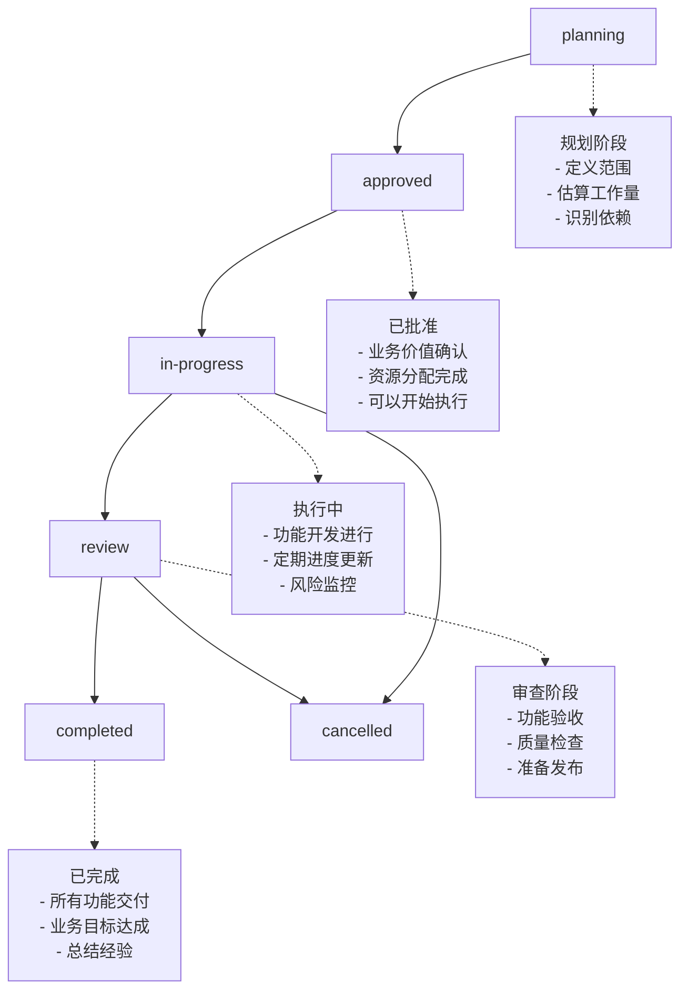

## 🎯 Epic管理

管理大型功能模块的完整生命周期，从创建到交付的端到端跟踪。

### 执行方式

```bash
# 创建新Epic
/pm:epic-manage create --name "用户认证系统" --description "完整的用户认证解决方案"

# 分解Epic为功能特性
/pm:epic-manage decompose --epic-id "EP001"

# 查看Epic状态
/pm:epic-manage status --epic-id "EP001"

# 更新Epic进度
/pm:epic-manage update --epic-id "EP001" --status "in-progress"

# 列出所有Epic
/pm:epic-manage list
```

### Epic数据结构

#### Epic定义文档
**文件路径**: `docs/epics/{EPIC_ID}.epic.md`

```yaml
epicInfo:
  id: "EP001"
  name: "用户认证系统"
  description: "提供完整的用户注册、登录、权限管理功能"
  status: "planning|in-progress|review|completed|cancelled"
  priority: "P0|P1|P2|P3"
  owner: "team-lead"
  
businessValue:
  userProblems:
    - "用户无法安全访问系统"
    - "缺乏统一的身份验证机制"
  businessGoals:
    - "提升用户体验安全性"
    - "统一用户管理流程"
  successMetrics:
    - metric: "用户注册转化率"
      target: ">15%"
      current: "8%"

scope:
  features:
    included:
      - "邮箱/手机注册登录"
      - "多因子认证"
      - "密码重置"
      - "会话管理"
    excluded:
      - "第三方OAuth (v2.0)"
      - "生物识别认证"
      - "企业SSO集成"
  
  timeline:
    startDate: "2024-01-15"
    targetDate: "2024-02-15"
    estimatedDays: 30
    
dependencies:
  internal:
    - epic: "用户管理系统"
      relation: "depends-on"
      status: "completed"
  external:
    - service: "邮件通知服务"
      relation: "requires"
      status: "available"

risks:
  - id: "ER001"
    description: "第三方服务依赖风险"
    impact: "high"
    mitigation: "准备备用服务商"

stakeholders:
  product: "product-manager"
  engineering: "tech-lead"
  qa: "qa-lead"
  
features:
  - featureId: "user-registration"
    name: "用户注册功能"
    status: "planning"
    priority: "P0"
    estimatedDays: 8
    
  - featureId: "user-authentication"
    name: "用户认证功能"
    status: "not-started"
    priority: "P0"
    estimatedDays: 10
```

### Epic管理命令

#### 1. 创建Epic

```bash
# 基础创建
/pm:epic-manage create --name "支付系统" --priority "P1"

# 详细创建（带描述和负责人）
/pm:epic-manage create \
  --name "支付系统" \
  --description "完整的在线支付解决方案" \
  --owner "payment-team" \
  --priority "P1" \
  --target-date "2024-03-01"
```

#### 2. Epic分解

将Epic分解为具体的功能特性：

```bash
# 自动分解Epic
/pm:epic-manage decompose --epic-id "EP001"

# 基于PRD分解  
/pm:epic-manage decompose --epic-id "EP001" --from-prd "docs/prd/payment-system.prd.md"

# 交互式分解
/pm:epic-manage decompose --epic-id "EP001" --interactive
```

**分解输出**:
- 生成多个Feature PRD文档
- 创建功能间依赖关系
- 估算Epic总体工作量
- 生成开发路线图

#### 3. Epic状态跟踪

```bash
# 查看Epic概览
/pm:epic-manage status --epic-id "EP001"

# 详细进度报告
/pm:epic-manage status --epic-id "EP001" --detailed

# Epic健康度检查
/pm:epic-manage health --epic-id "EP001"
```

**状态输出示例**:
```
==================================================
🎯 Epic状态: 用户认证系统 (EP001)
==================================================

📊 整体进度: ████████████████░░░░ 75% (3/4 功能完成)

🎯 基本信息:
  • 优先级: P0 (最高优先级)
  • 负责人: authentication-team
  • 开始时间: 2024-01-15
  • 目标完成: 2024-02-15 (剩余5天)
  • 状态: 进行中 ✅

📈 功能完成度:
  ✅ user-registration    (100% - 已完成)
  ✅ user-authentication  (100% - 已完成) 
  ✅ password-reset       (100% - 已完成)
  🔄 session-management   (45% - 开发中)

⏱️  时间线分析:
  • 已用时间: 25天
  • 剩余时间: 5天  
  • 进度状态: 按计划进行 ✅

🚨 风险提醒:
  • session-management功能存在技术难点
  • 需要额外2天完成Redis集成
  • 建议优先解决技术风险

👥 团队负载:
  • 活跃开发者: 3人
  • 当前并行任务: 4个
  • 代码审查队列: 1个PR
```

#### 4. Epic更新操作

```bash
# 更新Epic状态
/pm:epic-manage update --epic-id "EP001" --status "completed"

# 更新Epic时间线
/pm:epic-manage update --epic-id "EP001" --target-date "2024-02-20"

# 添加新功能到Epic
/pm:epic-manage add-feature --epic-id "EP001" --feature "user-profile"

# 移除功能
/pm:epic-manage remove-feature --epic-id "EP001" --feature "advanced-analytics"
```

#### 5. Epic列表和过滤

```bash
# 列出所有Epic
/pm:epic-manage list

# 按状态过滤
/pm:epic-manage list --status "in-progress"

# 按优先级过滤
/pm:epic-manage list --priority "P0,P1"

# 按负责人过滤  
/pm:epic-manage list --owner "frontend-team"
```

### Epic生命周期管理

#### 状态转换流程


### 与其他工具集成

#### GitHub Issues集成
```bash
# 为Epic创建GitHub Milestone
/pm:epic-manage sync-github --epic-id "EP001" --create-milestone

# 关联Epic下的所有Issues
/pm:epic-manage sync-github --epic-id "EP001" --link-issues

# 更新GitHub里程碑进度
/pm:epic-manage sync-github --epic-id "EP001" --update-progress
```

#### Slack/Teams通知
```bash
# Epic状态变更通知
/pm:epic-manage notify --epic-id "EP001" --channel "#product-updates"

# 风险提醒通知
/pm:epic-manage alert --epic-id "EP001" --type "risk" --channel "#dev-team"
```

### Epic报告生成

#### 进度报告
```bash
# 生成Epic进度报告
/pm:epic-manage report --epic-id "EP001" --type "progress" --format "markdown"

# 生成所有Epic的汇总报告
/pm:epic-manage report --type "summary" --output "reports/epic-summary.md"
```

#### 业务价值报告
```bash
# Epic价值实现报告
/pm:epic-manage report --epic-id "EP001" --type "business-value"

# 投资回报分析
/pm:epic-manage report --epic-id "EP001" --type "roi-analysis"
```

### 最佳实践

#### Epic规模控制
- **时间范围**: 2-8周完成
- **团队规模**: 3-8人参与
- **功能数量**: 3-12个相关功能
- **业务价值**: 有明确的用户价值

#### Epic质量标准
```yaml
质量检查:
  - [ ] 业务价值清晰可衡量
  - [ ] 功能范围边界明确
  - [ ] 技术依赖识别完整
  - [ ] 风险评估和缓解计划
  - [ ] 团队资源分配合理
  - [ ] 时间计划现实可行
```

#### 协作流程
1. **Epic创建**: 产品经理定义业务价值和范围
2. **技术评估**: 技术团队评估实现复杂度
3. **资源规划**: 项目经理安排人员和时间
4. **执行监控**: 定期更新进度和风险
5. **交付验收**: 业务方验收和价值确认

---
**集成命令**: 使用 `/pm:workflow-status` 查看Epic在整体工作流中的状态