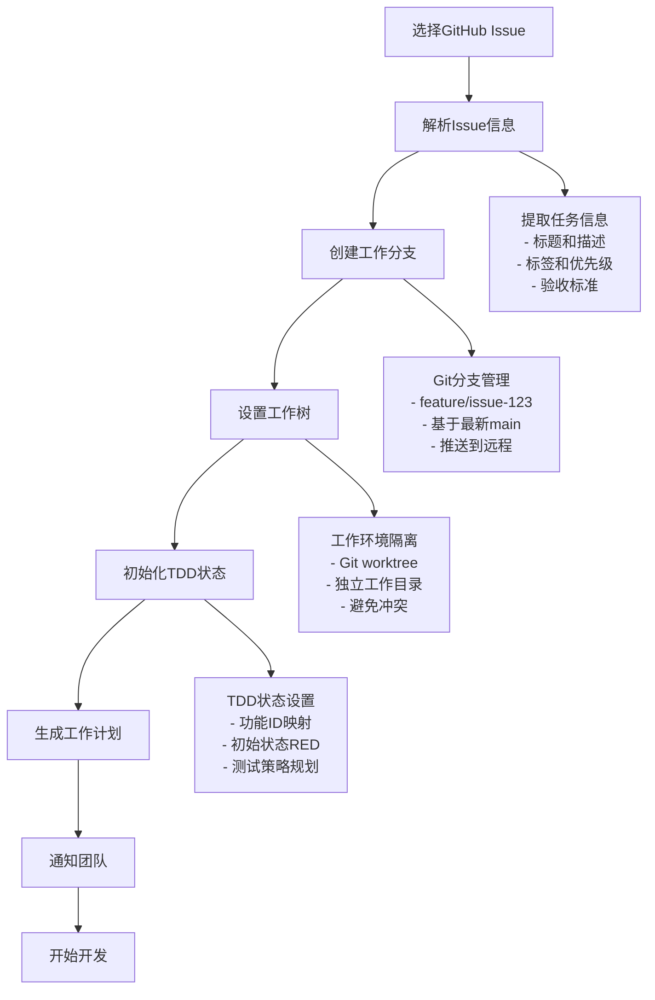

## 🚀 Issue工作启动

从GitHub Issue开始工作，自动化配置工作环境，包括分支创建、TDD状态初始化、工作树设置。

### 执行方式

```bash
# 从Issue编号开始工作
/pm:issue-start --issue 123

# 从Issue URL开始工作
/pm:issue-start --url "https://github.com/owner/repo/issues/123"

# 指定工作模式启动
/pm:issue-start --issue 123 --mode "tdd" --worktree

# 团队协作模式启动
/pm:issue-start --issue 123 --assign-self --notify-team
```

### 自动化工作流

#### 启动流程概览


### Issue信息解析

#### GitHub Issue分析
```bash
# 获取Issue详细信息
analyze_github_issue() {
    local issue_number="$1"
    
    # 获取基本信息
    local issue_data=$(gh issue view "$issue_number" --json title,body,labels,assignees,state,number)
    
    # 提取关键信息
    local title=$(echo "$issue_data" | jq -r '.title')
    local body=$(echo "$issue_data" | jq -r '.body')
    local labels=$(echo "$issue_data" | jq -r '.labels[].name')
    
    # 分析任务类型
    local task_type=$(determine_task_type "$labels")
    
    # 提取验收标准
    local acceptance_criteria=$(extract_acceptance_criteria "$body")
    
    echo "解析Issue: $title"
    echo "任务类型: $task_type"
    echo "验收标准: $acceptance_criteria"
}

# 确定任务类型
determine_task_type() {
    local labels="$1"
    
    case "$labels" in
        *"bug"*) echo "bug-fix" ;;
        *"feature"*) echo "feature-development" ;;
        *"refactor"*) echo "code-refactor" ;;
        *"test"*) echo "test-improvement" ;;
        *"docs"*) echo "documentation" ;;
        *) echo "general-task" ;;
    esac
}
```

#### 验收标准提取
```bash
# 从Issue描述中提取验收标准
extract_acceptance_criteria() {
    local issue_body="$1"
    
    # 查找验收标准部分
    echo "$issue_body" | grep -A 20 -i "acceptance.criteria\|验收标准\|AC:" | \
        grep -E "^\s*-|\*|[0-9]+\." | \
        sed 's/^[[:space:]]*[-*0-9.]*[[:space:]]*/- /'
}

# 生成测试用例建议
generate_test_suggestions() {
    local acceptance_criteria="$1"
    local task_type="$2"
    
    echo "# 建议测试用例"
    echo "$acceptance_criteria" | while read -r criterion; do
        if [[ -n "$criterion" ]]; then
            echo "- 测试: $criterion"
            echo "  - Given: [前置条件]"
            echo "  - When: [操作步骤]"  
            echo "  - Then: [期望结果]"
        fi
    done
}
```

### 工作环境设置

#### 分支和工作树管理
```bash
# 创建和设置工作分支
setup_work_branch() {
    local issue_number="$1"
    local task_type="$2"
    
    # 生成分支名
    local branch_name="feature/issue-${issue_number}"
    if [[ "$task_type" == "bug-fix" ]]; then
        branch_name="bugfix/issue-${issue_number}"
    elif [[ "$task_type" == "refactor" ]]; then
        branch_name="refactor/issue-${issue_number}"
    fi
    
    # 检查并创建分支
    if ! git show-ref --verify --quiet "refs/heads/$branch_name"; then
        git checkout -b "$branch_name"
        git push -u origin "$branch_name"
        echo "✅ 创建并推送分支: $branch_name"
    else
        git checkout "$branch_name"
        echo "✅ 切换到现有分支: $branch_name"
    fi
}

# 创建隔离工作树（可选）
setup_worktree() {
    local issue_number="$1"
    local branch_name="$2"
    
    local worktree_path="../worktrees/issue-${issue_number}"
    
    # 创建工作树
    if [[ ! -d "$worktree_path" ]]; then
        git worktree add "$worktree_path" "$branch_name"
        echo "✅ 创建工作树: $worktree_path"
        
        # 切换到工作树目录
        cd "$worktree_path"
        echo "📂 工作目录: $(pwd)"
    else
        cd "$worktree_path"
        echo "✅ 使用现有工作树: $worktree_path"
    fi
}
```

#### TDD状态初始化
```bash
# 初始化TDD开发环境
initialize_tdd_state() {
    local issue_number="$1"
    local task_type="$2"
    local acceptance_criteria="$3"
    
    # 生成功能ID
    local feature_id="issue-${issue_number}"
    
    # 创建TDD状态文件
    cat > .claude/tdd-state.json << EOF
{
  "projectRoot": "$(pwd)",
  "currentPhase": "RED",
  "featureId": "$feature_id",
  "taskType": "$task_type",
  "githubIssue": $issue_number,
  "testsPassing": false,
  "startedAt": "$(date -u +%Y-%m-%dT%H:%M:%SZ)",
  "acceptanceCriteria": $(echo "$acceptance_criteria" | jq -R -s 'split("\n") | map(select(length > 0))'),
  "tddCycles": [],
  "currentCycle": {
    "red": null,
    "green": null, 
    "refactor": null
  },
  "lastUpdate": "$(date -u +%Y-%m-%dT%H:%M:%SZ)"
}
EOF

    echo "✅ TDD状态已初始化: $feature_id"
    echo "🔴 当前阶段: RED (准备编写失败测试)"
}
```

### 工作计划生成

#### 自动生成开发计划
```bash
# 基于Issue生成工作计划
generate_work_plan() {
    local issue_number="$1"
    local title="$2"
    local acceptance_criteria="$3"
    local task_type="$4"
    
    local plan_file="docs/work-plans/issue-${issue_number}.plan.md"
    mkdir -p "docs/work-plans"
    
    cat > "$plan_file" << EOF
# Issue #${issue_number} 工作计划

## 📋 任务信息
- **标题**: $title
- **类型**: $task_type
- **GitHub**: [Issue #${issue_number}](https://github.com/$(gh repo view --json owner,name | jq -r '"\(.owner.login)/\(.name)"')/issues/$issue_number)
- **开始时间**: $(date)

## 🎯 验收标准
$acceptance_criteria

## 📝 TDD开发计划

### Phase 1: RED (编写失败测试)
- [ ] 分析验收标准，确定测试场景
- [ ] 编写单元测试（预期失败）
- [ ] 编写集成测试（如需要）
- [ ] 确认测试失败且失败原因正确

### Phase 2: GREEN (最小实现)
- [ ] 实现最小可工作代码
- [ ] 确保所有测试通过
- [ ] 不进行过度设计
- [ ] 专注于满足当前测试

### Phase 3: REFACTOR (重构优化)
- [ ] 改善代码结构和可读性
- [ ] 消除重复代码
- [ ] 优化性能（如需要）
- [ ] 确保重构后测试依然通过

### 完成检查
- [ ] 所有验收标准都有对应测试
- [ ] 测试覆盖率满足项目要求
- [ ] 代码审查通过
- [ ] 功能验证通过
- [ ] 文档更新完成

## 📊 进度跟踪
$(date): 开始开发，当前处于RED阶段

## 🔗 相关文档
- TDD状态文件: \`.claude/tdd-state.json\`
- 测试文件: \`tests/**/*issue-${issue_number}*\`
- 实现文件: \`src/**/*\` (待确定)

---
**提示**: 使用 \`/tdd:red\` 开始第一个TDD循环
EOF

    echo "✅ 工作计划已生成: $plan_file"
}
```

### 团队协作集成

#### 任务分配和通知
```bash
# 自动分配Issue给自己
assign_issue_to_self() {
    local issue_number="$1"
    
    gh issue edit "$issue_number" --add-assignee "@me"
    echo "✅ Issue已分配给自己"
}

# 添加进度标签
add_progress_labels() {
    local issue_number="$1"
    
    # 移除旧状态标签
    gh issue edit "$issue_number" --remove-label "status:todo,status:in-progress,status:review,status:done"
    
    # 添加新状态标签
    gh issue edit "$issue_number" --add-label "status:in-progress,tdd:red"
    
    echo "✅ 状态标签已更新"
}

# 发送开始通知
notify_team_start() {
    local issue_number="$1"
    local title="$2"
    
    # GitHub评论
    gh issue comment "$issue_number" --body "🚀 开始处理此Issue

**开发状态**: TDD RED阶段  
**分支**: \`feature/issue-${issue_number}\`  
**预计完成**: $(date -d '+3 days' +%Y-%m-%d)

将按照TDD流程进行开发，完成后会更新进度。"

    echo "✅ 团队通知已发送"
}
```

### 智能化建议

#### 任务复杂度评估
```bash
# 评估任务复杂度
assess_task_complexity() {
    local title="$1"
    local body="$2"
    local labels="$3"
    
    local complexity_score=1
    
    # 基于标题长度
    if [[ ${#title} -gt 50 ]]; then
        ((complexity_score++))
    fi
    
    # 基于描述长度
    if [[ ${#body} -gt 500 ]]; then
        ((complexity_score++))
    fi
    
    # 基于标签
    case "$labels" in
        *"epic"*) ((complexity_score+=3)) ;;
        *"architecture"*) ((complexity_score+=2)) ;;
        *"integration"*) ((complexity_score+=2)) ;;
        *"performance"*) ((complexity_score+=2)) ;;
        *"security"*) ((complexity_score+=2)) ;;
        *"bug"*) ((complexity_score--)) ;;
    esac
    
    # 输出复杂度评估
    if [[ $complexity_score -le 2 ]]; then
        echo "🟢 简单 (预计1-2天)"
    elif [[ $complexity_score -le 4 ]]; then
        echo "🟡 中等 (预计3-5天)"
    else
        echo "🔴 复杂 (预计1-2周，建议分解)"
    fi
}

# 提供开发建议
provide_development_suggestions() {
    local task_type="$1"
    local complexity="$2"
    
    echo "## 💡 开发建议"
    
    case "$task_type" in
        "feature-development")
            echo "- 优先编写API接口测试"
            echo "- 考虑数据模型设计"
            echo "- 注意错误处理和边界条件"
            ;;
        "bug-fix")
            echo "- 首先重现bug的测试用例"
            echo "- 分析根本原因"
            echo "- 确保修复不引入新问题"
            ;;
        "refactor")
            echo "- 确保现有测试覆盖充分"
            echo "- 小步重构，频繁验证"
            echo "- 保持对外接口不变"
            ;;
    esac
    
    if [[ "$complexity" == *"复杂"* ]]; then
        echo "- ⚠️  任务复杂度较高，建议分解为多个子任务"
        echo "- 💭 考虑与团队讨论技术方案"
        echo "- 📝 编写详细的设计文档"
    fi
}
```

### 使用场景和示例

#### 场景1: 新功能开发
```bash
# Issue #145: 实现用户头像上传功能
/pm:issue-start --issue 145 --mode tdd --worktree

# 自动执行:
# 1. 创建 feature/issue-145 分支
# 2. 设置独立工作树
# 3. 初始化TDD状态 (feature-id: issue-145)
# 4. 生成基于验收标准的测试建议
# 5. 通知团队开始工作
```

#### 场景2: Bug修复
```bash
# Issue #89: 登录失败时错误信息不准确  
/pm:issue-start --issue 89

# 自动执行:
# 1. 创建 bugfix/issue-89 分支
# 2. 分析bug描述，建议先写重现bug的测试
# 3. 设置TDD状态为bug-fix模式
# 4. 更新Issue状态为in-progress
```

#### 场景3: 团队协作模式
```bash
# Issue #200: 重构支付模块
/pm:issue-start --issue 200 --assign-self --notify-team --complexity-check

# 自动执行:
# 1. 评估任务复杂度
# 2. 如果复杂，建议分解任务
# 3. 分配Issue给自己
# 4. 通知相关团队成员
# 5. 创建详细工作计划
```

### 集成和配置

#### 配置选项
```json
{
  "issueStart": {
    "defaultMode": "tdd",
    "autoAssign": true,
    "autoNotify": false,
    "worktreeEnabled": true,
    "branchNaming": {
      "feature": "feature/issue-{number}",
      "bugfix": "bugfix/issue-{number}",
      "refactor": "refactor/issue-{number}"
    },
    "notifications": {
      "slack": {
        "enabled": false,
        "channel": "#development"
      },
      "github": {
        "enabled": true,
        "commentOnStart": true
      }
    }
  }
}
```

### 错误处理和恢复

#### 常见问题处理
```bash
# 处理分支冲突
handle_branch_conflicts() {
    local issue_number="$1"
    local branch_name="feature/issue-${issue_number}"
    
    if git show-ref --verify --quiet "refs/heads/$branch_name"; then
        echo "⚠️  分支已存在，是否要："
        echo "1. 切换到现有分支继续工作"
        echo "2. 创建新分支 ${branch_name}-v2"
        echo "3. 强制重新创建分支（丢失现有更改）"
        
        read -p "选择 (1-3): " choice
        case $choice in
            1) git checkout "$branch_name" ;;
            2) git checkout -b "${branch_name}-v2" ;;
            3) git branch -D "$branch_name"; git checkout -b "$branch_name" ;;
        esac
    fi
}

# 恢复工作状态
restore_work_state() {
    local issue_number="$1"
    
    # 检查是否有现有工作状态
    if [[ -f ".claude/tdd-state.json" ]]; then
        local existing_issue=$(jq -r '.githubIssue' .claude/tdd-state.json)
        
        if [[ "$existing_issue" != "$issue_number" ]]; then
            echo "⚠️  检测到其他Issue的工作状态 (#$existing_issue)"
            echo "是否要保存当前状态并切换到Issue #$issue_number?"
            read -p "(y/n): " confirm
            
            if [[ "$confirm" == "y" ]]; then
                # 备份当前状态
                cp .claude/tdd-state.json ".claude/tdd-state-backup-issue-${existing_issue}.json"
                echo "✅ 已备份状态到 tdd-state-backup-issue-${existing_issue}.json"
            fi
        fi
    fi
}
```

### 最佳实践

#### 工作流程建议
1. **Issue选择**: 选择明确定义、验收标准清晰的Issue
2. **分支策略**: 使用描述性分支名，保持分支小而专注
3. **TDD实践**: 严格遵循RED-GREEN-REFACTOR循环
4. **团队沟通**: 及时更新Issue状态，分享进度

#### 效率提升技巧
1. **模板利用**: 使用Issue模板确保信息完整
2. **自动化**: 启用自动通知和状态更新
3. **工作树**: 使用工作树避免分支切换成本
4. **并行工作**: 多个Issue可以同时处理（不同工作树）

---
**下一步**: 使用 `/tdd:red` 开始第一个TDD循环，或使用 `/pm:workflow-status` 查看整体项目进度