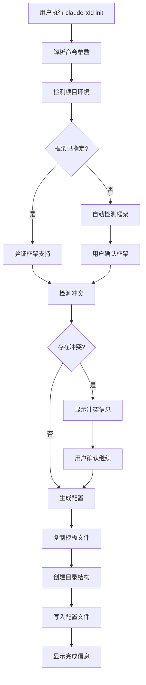
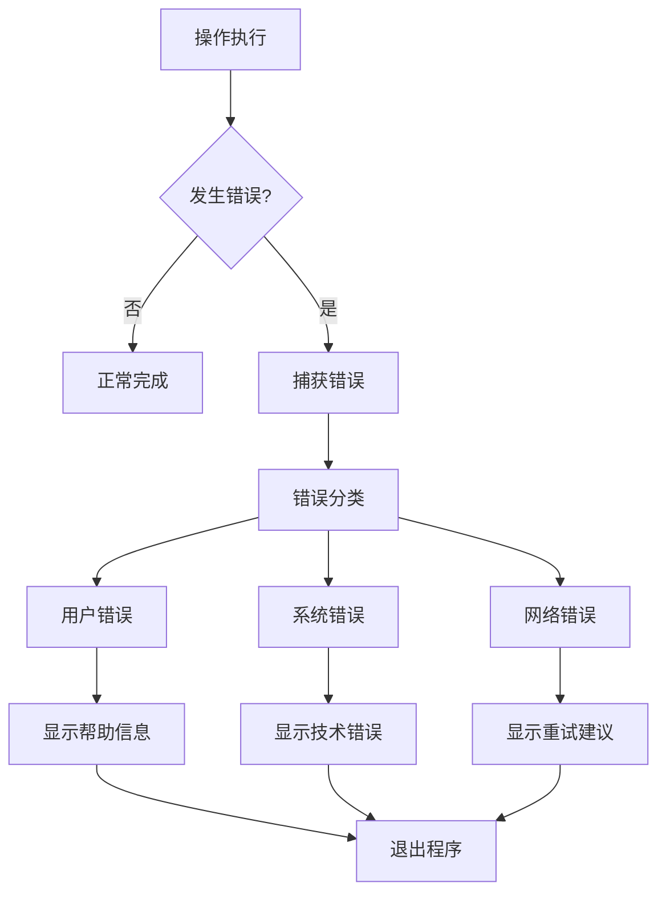

# 🏗️ 架构设计

本文档详细介绍了 Claude TDD CLI 的系统架构、设计原则和核心组件。

## 📐 整体架构

Claude TDD CLI 采用模块化、可扩展的架构设计，主要分为以下几层：

```
┌─────────────────────────────────────────────────┐
│                CLI Layer                        │
│  命令行接口和用户交互                              │
└─────────────────┬───────────────────────────────┘
                  │
┌─────────────────┴───────────────────────────────┐
│              Command Layer                      │
│  具体命令实现 (init, doctor, status, config)      │
└─────────────────┬───────────────────────────────┘
                  │
┌─────────────────┴───────────────────────────────┐
│               Core Layer                        │
│  核心业务逻辑 (检测, 生成, 管理)                    │
└─────────────────┬───────────────────────────────┘
                  │
┌─────────────────┴───────────────────────────────┐
│              Template Layer                     │
│  模板管理和文件生成                               │
└─────────────────┬───────────────────────────────┘
                  │
┌─────────────────┴───────────────────────────────┐
│               File System                       │
│  文件系统操作和配置管理                           │
└─────────────────────────────────────────────────┘
```

## 🎯 设计原则

### 1. 单一职责原则 (SRP)
每个模块只负责一个特定功能：

- **检测器**：只负责环境和框架检测
- **生成器**：只负责配置文件生成
- **管理器**：只负责模板管理

### 2. 开闭原则 (OCP)
对扩展开放，对修改关闭：

- 新框架支持通过配置添加
- 新命令通过插件机制扩展
- 模板系统支持自定义模板

### 3. 依赖倒置原则 (DIP)
高层模块不依赖低层模块：

```typescript
// 抽象接口
interface IFrameworkDetector {
  detectFramework(path: string): FrameworkInfo;
}

// 具体实现
class FileSystemDetector implements IFrameworkDetector {
  detectFramework(path: string): FrameworkInfo {
    // 实现逻辑
  }
}

// 高层模块依赖抽象
class InitCommand {
  constructor(private detector: IFrameworkDetector) {}
}
```

### 4. 接口隔离原则 (ISP)
客户端不应该依赖它不需要的接口：

```typescript
// 细分接口
interface IConfigReader {
  readConfig(path: string): Config;
}

interface IConfigWriter {
  writeConfig(path: string, config: Config): void;
}

// 而不是一个大接口
interface IConfigManager extends IConfigReader, IConfigWriter {}
```

## 🧩 核心组件

### 1. CLI 层 (src/index.ts)

**职责**：命令行接口和参数解析

```typescript
// 主程序入口
export class ClaudeTDDCLI {
  private program: Command;
  
  constructor() {
    this.program = new Command();
    this.setupCommands();
  }
  
  private setupCommands() {
    this.program
      .command('init')
      .description('初始化 TDD 工作流')
      .option('--framework <type>', '指定框架')
      .action(this.handleInit.bind(this));
  }
}
```

**特点**：
- 使用 Commander.js 进行参数解析
- 统一的错误处理
- 优雅的用户交互

### 2. 命令层 (src/commands/)

每个命令都是独立的模块，遵循相同的结构：

```typescript
// 命令接口
interface CommandOptions {
  framework?: string;
  quick?: boolean;
  force?: boolean;
}

// 命令实现
export async function initCommand(options: CommandOptions): Promise<void> {
  // 1. 参数验证
  // 2. 业务逻辑调用
  // 3. 结果展示
  // 4. 错误处理
}
```

#### 命令分类

| 命令 | 功能 | 依赖组件 |
|------|------|----------|
| `init` | 项目初始化 | Detector, TemplateManager, ConfigGenerator |
| `doctor` | 环境诊断 | Detector, HealthChecker |
| `status` | 状态查看 | ConfigReader, StatusAnalyzer |
| `config` | 配置管理 | ConfigManager |

### 3. 核心业务层 (src/core/)

#### 3.1 环境检测器 (detector.ts)

```typescript
export class EnvironmentDetector {
  // 检测 Claude Code
  async detectClaudeCode(): Promise<ClaudeCodeInfo> {
    // 实现逻辑
  }
  
  // 检测项目框架
  detectProject(projectPath: string): ProjectInfo {
    // 实现逻辑
  }
  
  // 检测 Git 仓库
  detectGit(projectPath: string): GitInfo {
    // 实现逻辑
  }
  
  // 检测冲突
  detectConflicts(projectPath: string): ConflictInfo[] {
    // 实现逻辑
  }
}
```

**检测流程**：
```
用户输入路径
    ↓
检测文件标识 (package.json, pom.xml, etc.)
    ↓
确定框架类型
    ↓
验证框架版本
    ↓
返回框架信息
```

#### 3.2 模板管理器 (template-manager.ts)

```typescript
export class TemplateManager {
  private templates: Map<string, Template> = new Map();
  
  // 加载模板
  loadTemplates(): void {
    // 从文件系统加载模板
  }
  
  // 渲染模板
  renderTemplate(templateName: string, data: TemplateData): string {
    // 模板渲染逻辑
  }
  
  // 复制模板文件
  copyTemplateFiles(source: string, target: string, data: TemplateData): void {
    // 文件复制逻辑
  }
}
```

**模板系统设计**：
```
templates/
├── common/          # 通用模板
│   ├── .gitignore
│   └── README.md
├── nodejs/          # Node.js 专用
│   ├── package.json.hbs
│   └── jest.config.js.hbs
└── python/          # Python 专用
    ├── pyproject.toml.hbs
    └── pytest.ini.hbs
```

#### 3.3 配置生成器 (config-generator.ts)

```typescript
export class ConfigGenerator {
  // 生成主配置
  generateMainConfig(framework: string, options: ConfigOptions): Config {
    // 配置生成逻辑
  }
  
  // 生成 TDD 状态配置
  generateTDDStateConfig(): TDDState {
    // TDD 状态配置
  }
  
  // 生成框架特定配置
  generateFrameworkConfig(framework: string): FrameworkConfig {
    // 框架配置逻辑
  }
}
```

### 4. 用户界面层 (src/ui/)

#### 4.1 输出管理 (output.ts)

```typescript
export class OutputManager {
  // 成功信息
  success(message: string): void {
    console.log(chalk.green('✅', message));
  }
  
  // 错误信息
  error(message: string, error?: Error): void {
    console.error(chalk.red('❌', message));
    if (error) console.error(chalk.gray(error.stack));
  }
  
  // 警告信息
  warn(message: string): void {
    console.warn(chalk.yellow('⚠️', message));
  }
  
  // 信息输出
  info(message: string): void {
    console.info(chalk.blue('ℹ️', message));
  }
}
```

#### 4.2 交互界面

```typescript
export class InteractiveUI {
  // 选择框架
  async selectFramework(detected?: string): Promise<string> {
    // 使用 inquirer 实现
  }
  
  // 确认操作
  async confirm(message: string, defaultValue = false): Promise<boolean> {
    // 确认对话框
  }
  
  // 进度指示
  createProgressBar(total: number): ProgressBar {
    // 创建进度条
  }
}
```

## 🔄 数据流

### 初始化命令数据流



### 错误处理流



## 📊 扩展机制

### 1. 框架扩展

添加新框架支持只需要：

```typescript
// 1. 定义框架配置
export const NEW_FRAMEWORK: FrameworkConfig = {
  name: 'new-framework',
  displayName: 'New Framework',
  detectionFiles: ['framework.config.js'],
  testCommand: 'framework test',
  buildCommand: 'framework build',
  templates: ['new-framework']
};

// 2. 注册框架
SUPPORTED_FRAMEWORKS.set('new-framework', NEW_FRAMEWORK);

// 3. 添加检测逻辑
detector.addFrameworkDetection('new-framework', (path) => {
  return fs.existsSync(path.join(path, 'framework.config.js'));
});
```

### 2. 命令扩展

添加新命令：

```typescript
// 1. 创建命令文件
// src/commands/new-command.ts
export async function newCommand(options: NewCommandOptions) {
  // 命令逻辑
}

// 2. 注册命令
// src/index.ts
program
  .command('new-command')
  .description('新命令描述')
  .action(newCommand);
```

### 3. 插件机制

未来计划支持插件系统：

```typescript
interface Plugin {
  name: string;
  version: string;
  activate(context: PluginContext): void;
  deactivate(): void;
}

class PluginManager {
  private plugins: Map<string, Plugin> = new Map();
  
  loadPlugin(pluginPath: string): void {
    // 加载插件逻辑
  }
  
  activatePlugin(name: string): void {
    // 激活插件
  }
}
```

## 🛡️ 安全考虑

### 1. 路径安全

```typescript
// 防止路径遍历攻击
function sanitizePath(inputPath: string): string {
  const resolved = path.resolve(inputPath);
  const relative = path.relative(process.cwd(), resolved);
  
  if (relative.startsWith('..')) {
    throw new Error('路径遍历攻击检测');
  }
  
  return resolved;
}
```

### 2. 输入验证

```typescript
// 验证框架名称
function validateFrameworkName(name: string): boolean {
  return /^[a-z][a-z0-9-]*$/i.test(name);
}

// 验证配置值
function validateConfigValue(key: string, value: any): boolean {
  const schema = getConfigSchema();
  return schema.validate({ [key]: value }).error === undefined;
}
```

### 3. 文件操作安全

```typescript
// 安全的文件写入
async function safeWriteFile(filePath: string, content: string): Promise<void> {
  // 检查路径合法性
  validateFilePath(filePath);
  
  // 创建临时文件
  const tempPath = `${filePath}.tmp`;
  
  try {
    await fs.writeFile(tempPath, content);
    await fs.rename(tempPath, filePath);
  } catch (error) {
    await fs.unlink(tempPath).catch(() => {});
    throw error;
  }
}
```

## 📈 性能优化

### 1. 启动性能

- **延迟加载**：只在需要时加载模块
- **缓存机制**：缓存框架检测结果
- **并行处理**：并行执行独立操作

```typescript
// 延迟加载示例
class LazyTemplateManager {
  private _templateManager?: TemplateManager;
  
  get templateManager(): TemplateManager {
    if (!this._templateManager) {
      this._templateManager = new TemplateManager();
    }
    return this._templateManager;
  }
}
```

### 2. 内存优化

- **流处理**：处理大文件时使用流
- **及时清理**：释放不再需要的资源
- **对象池**：重用频繁创建的对象

### 3. I/O 优化

- **批量操作**：合并文件系统操作
- **异步处理**：使用 Promise.all 并行处理
- **缓存结果**：避免重复的文件系统查询

## 📝 测试架构

### 测试策略

```
测试金字塔：
    /\
   /  \    E2E 测试 (少量)
  /____\   集成测试 (适量)  
 /______\  单元测试 (大量)
/__________\ 
```

### 测试分类

1. **单元测试**：测试单个函数或类
2. **集成测试**：测试模块间协作
3. **E2E 测试**：测试完整用户场景
4. **性能测试**：测试性能指标

---

**文档版本**: 1.0.0  
**最后更新**: 2025-09-08  
**维护者**: 架构团队